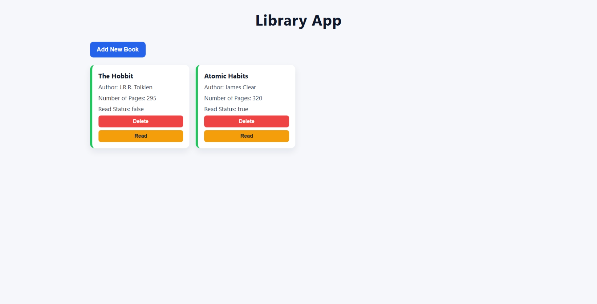

# Library Project

A simple library app built with vanilla JavaScript, HTML, and CSS. You can add books, view them as cards, toggle read status, and remove books from the library.



## Features

- Add a new book using a modal form
- Store each book with title, author, pages, and read status
- Display all books in a responsive card grid
- Toggle a book between read and unread states
- Delete a book from the library

## Technologies Used

- HTML5
- CSS3
- JavaScript (ES6)
- Browser Dialog API (`<dialog>`)

## Project Structure

```text
library-project/
├── index.html
├── style.css
└── script.js
```

## Screenshots

Add project screenshots here.

Example:

- Home view
- Add Book dialog

## License

This project is created as part of The Odin Project curriculum.
